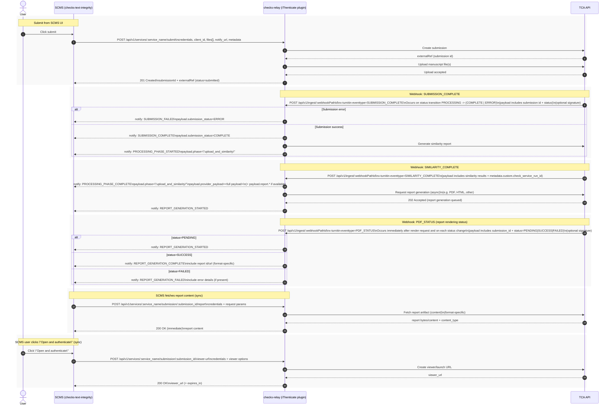

# Text integrity webhook planning (diagram-first)

This doc is intentionally diagram-first. It captures the intended flow between SCMS (checks-text-integrity), checks-relay (iThenticate plugin), and TCA, focusing on the synchronous submit and the first webhook (`SUBMISSION_COMPLETE`). Later webhooks (e.g. similarity completion) will be diagrammed in a follow-up iteration.

---

## Sequence diagram (single; will grow)

This is the single sequence diagram we’ll keep extending as we add later webhook events.

---

## Notes / gaps (brief)

- Single vs double notify: relay ingest currently performs one `fetch(notifyUrl, …)` per webhook after `parseWebhook`. The target flow needs two SCMS notifications (or one envelope with two logical events); the diagram shows two posts as described.
- SCMS hook shape: the SCMS notify route currently parses `event: 'SUBMISSION_COMPLETE'` style payloads, while relay forwarding today is a relay envelope (`id`, `clientId`, `serviceName`, `status`, `message`, `result`, `updatedAt`). Aligning SCMS parsing with relay (or transforming in relay) is follow-on work.
- Notify payload types: define clear, concise TypeScript types for the notify payloads we send back to SCMS (submission outcome, processing started, similarity complete + report id/url, report generation started). Put these in `checks-relay/packages/types/src/notify.ts` and keep them snake_case on the wire.
- Credentials for step 2 on ingest: submit provides `credentials`, but the relay `Submission` model does not store TCA API keys. Calling report generation from ingest needs a design decision (persist encrypted credentials on submit, or relay-held TCA configuration).
- `parseWebhook` mapping today: for `SUBMISSION_COMPLETE`, iThenticate `parseWebhook` maps to `status: "processing"` or `error` and provides a single ingest-driven notify today; it is a useful baseline for extension.

---

## Out of scope for this iteration

- Full state machine for `serviceData.stage` in SCMS.
- `SIMILARITY_COMPLETE` / PDF / later webhooks.

---

## Implementation plan (phased)

### Phase_1: revisit and complete shared client contracts (types)

Goal: ensure `@checks-relay/types` fully describes the **client-facing relay API** and the **relay→SCMS notify webhook contract** (standardized across plugins), while keeping plugin interface types and relay internal/DB types separate.

Tasks:
- Confirm/retain type boundaries in `@checks-relay/types`:
  - client-facing relay API types
  - client-facing notify webhook types (**currently missing**)
  - plugin interface types
  - internal relay app (DB/persistence) types
- Add the standardized notify contract to `@checks-relay/types` (e.g. `src/api/notify.ts`), including:
  - an explicit `event` field with generic event names (shared across plugins)
  - event-specific payload types
  - a clear `metadata` field for plugin-specific additions
  - snake_case wire keys
- Directional constraint: **API/notify/plugin interface types must not depend on internal/DB types**, since we intend to remove the relay DB over time.

Note: we already split some of these layers, but the notify interface is not yet defined in `@checks-relay/types/src`.

### Phase_2: checks-relay iThenticate + ingest orchestration to match this sequence diagram

Goal: implement relay-side orchestration so that inbound TCA webhooks and follow-on TCA calls produce the standardized SCMS notify events described in the diagram.

#### Phase_2.A — Establish tenant-level TCA credentials in relay (no per-submission creds)

Decision captured: relay should store **per-tenant/per-integration** TCA credentials (needed for webhook-triggered calls like report generation).

Tasks:
- Define where tenant credentials live (suggest: relay `objectStore` via a new `id_type`, scoped by integration identifier).
- Ensure `ithenticate.configure` writes/updates that credential reference (not the secret itself unless encrypted-at-rest) and that runtime code can resolve credentials when handling webhooks.
- Document rotation story (what happens when api_key changes; how to reconcile existing webhook registrations).

#### Phase_2.B — Standardize relay→SCMS notify event contract (snake_case) and emit multiple events per webhook when required

Decision captured: SCMS consumes a **standardized set of notify events** across plugins, each with its own typed payload; plugin-specific data goes under a `metadata` field.

Tasks:
- Define notify event types (in `@checks-relay/types`, e.g. `api/notify.ts`) for:
  - `submission_complete` (success | error, derived from `SUBMISSION_COMPLETE.status`)
  - `report_processing_started` (after similarity generation is initiated)
  - `similarity_complete` (include full webhook payload + ingest report id/url if available)
  - `report_generation_started`
  - `report_generation_complete`
  - `report_generation_failed`
- Update relay ingest handler (`POST /api/v1/ingest/:webhookPathId`) to:
  - always persist the raw webhook payload as an event (for audit/debug)
  - emit **one or more** notify events depending on webhook type/status
  - use **snake_case on the wire** (including notify payload keys)

#### Phase_2.C — iThenticate plugin: make webhook parsing + orchestration inputs sufficient

Current state:
- `parseWebhook` maps:
  - `SUBMISSION_COMPLETE` → `processing` or `error`
  - `SIMILARITY_COMPLETE` → `completed`
  - `PDF_STATUS` → `processing|completed|error` with `pdfStatus`
- But it does not expose a normalized **event name** (only inferred from headers), and relay ingest currently only forwards a single generic notify payload.

Tasks:
- Decide whether to:
  - extend the plugin→relay webhook parse result to include a normalized event (recommended), or
  - re-parse `x-turnitin-eventtype` in relay ingest and treat plugin `parseWebhook` as status/result-only.
- Ensure `SUBMISSION_COMPLETE` logic checks `body.status` (`PROCESSING -> COMPLETE|ERROR`) and branches accordingly (already present in plugin, but needs to map into the new notify contract).
- Ensure similarity-complete payload handling supports including the full webhook payload (or a safely redacted subset) in notify.

#### Phase_2.D — Similarity generation and report rendering (TCA calls)

Tasks:
- On `SUBMISSION_COMPLETE` success:
  - relay triggers similarity generation (TCA “generate similarity” call)
  - relay emits notify `report_processing_started`
- On `SIMILARITY_COMPLETE`:
  - relay emits notify `similarity_complete` (include webhook payload + report id/url)
  - relay triggers report rendering generation (async)
  - relay emits notify `report_generation_started`
- On `PDF_STATUS`:
  - relay maps `PENDING|SUCCESS|FAILED` into report-generation notify events (in report terms, not “pdf” terms)

Notes:
- The iThenticate plugin currently has `generateReport` which calls `PUT /submissions/:id/similarity` and returns `mimeType: application/pdf`. We will need to reconcile naming:
  - “similarity generation” vs “report rendering/export”
- The iThenticate `TcaClient` does not yet expose endpoints for “render/export report” or “download report artifact”; these will need to be added based on the TCA docs.

#### Phase_2.E — Relay client-facing endpoints (snake_case) for report content + viewer URL

Tasks:
- Ensure request/response wire keys for:
  - `POST /api/v1/services/:service_name/submission/:submission_id/report`
  - `POST /api/v1/services/:service_name/submission/:submission_id/viewer-url`
  are snake_case (currently many plugin payloads are camelCase).
- Implement iThenticate `getReport` (currently not implemented) once the correct TCA artifact endpoints are known.
- Align viewer-url request options to snake_case (e.g. `viewer_user_id`, `permission_set`, etc.) and map to TCA payload.

#### Phase_2.F — Tests

Tasks:
- Add relay ingest tests for each webhook:
  - `SUBMISSION_COMPLETE` COMPLETE vs ERROR
  - `SIMILARITY_COMPLETE`
  - `PDF_STATUS` PENDING → SUCCESS/FAILED transitions
- Verify notify events emitted match the standardized event contract (and remain plugin-agnostic).

### Phase_3: SCMS extension state machine + `serviceData.stage` schema

Goal: implement an explicit state machine in the Text Integrity extension that consumes the standardized relay notify events and updates `serviceData.stage` (and related fields) deterministically.

Tasks:
- Define `serviceData.stage` enum aligned to notify events (e.g. `submitted`, `submission_complete`, `report_processing_started`, `similarity_complete`, `report_generation_started`, `report_generation_complete`, `report_ready`, `error`).
- Update SCMS notify route to parse the new notify event contract (snake_case) and update `CheckServiceRunData` accordingly.
- Ensure SCMS UI uses stage + available URLs to drive actions:
  - show similarity summary
  - show “fetch report content” and/or “open and authenticate” actions only when available
- Add integration-ish tests at the extension level for stage transitions driven by notify events.

