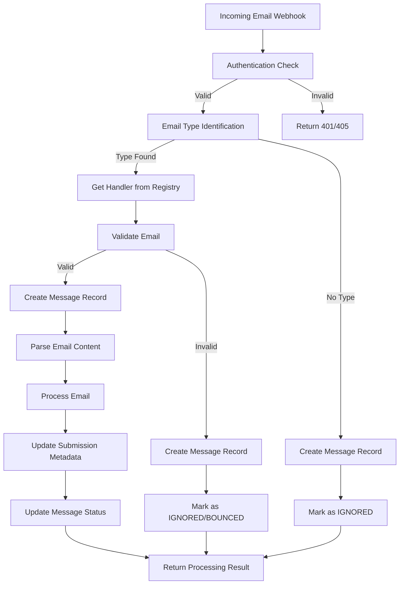

# PMC Email Processing Workflow

## Overview

The PMC email processing system handles incoming emails from various sources (primarily NIHMS) and processes them to update submission statuses and metadata. The system uses a registry-based architecture that routes different types of emails to specialized handlers.

## Architecture

The email processing system consists of several key components:

- **Email Server** (`email.server.ts`) - Handles authentication and initial request processing
- **Email Processor** (`email-processor.server.ts`) - Main orchestration logic
- **Email Registry** (`registry.server.ts`) - Routes emails to appropriate handlers
- **Email Handlers** - Specialized processors for different email types
- **Email Parser** (`email-parser.server.ts`) - Extracts data from email content
- **Email Database** (`email-db.server.ts`) - Persists processing results

## Workflow Diagram



## Detailed Workflow Steps

### 1. Email Reception (`email.server.ts`)

**Function**: `authThrowOnInvalidCredentials()`

**Purpose**: Validates incoming webhook requests using Basic Authentication

**Process**:
1. Extract credentials from `Authorization` header
2. Decode Base64 credentials
3. Compare against configured username/password
4. Return 401 for invalid credentials, 405 for missing config

**Configuration**: 
- `ctx.$config.app.extensions.pmc.inboundEmail.username`
- `ctx.$config.app.extensions.pmc.inboundEmail.password`

### 2. Email Type Identification (`email-processor.server.ts`)

**Function**: `processInboundEmail()`

**Purpose**: Determines which handler should process the email

**Process**:
1. Call `pmcEmailTypeRegistry.identifyType(payload)`
2. Each registered handler's `identify()` method is called
3. First handler to return `true` is selected
4. If no handler matches, email is marked as IGNORED

**Available Handlers**:
- `bulk-submission-initial-email` - NIHMS bulk submission results
- `nihms-files-request` - NIHMS file request notifications  
- `catch-all` - Fallback handler for unmatched emails

### 3. Email Validation (`email-processor.server.ts`)

**Function**: Handler-specific `validate()` method

**Purpose**: Ensures email meets type-specific requirements

**Process**:
1. **Step 1 (Early Security Check)**: Validate sender against allowed list using `validateEmailSender()` from `email-validation.server.ts`
2. Get handler configuration from registry
3. Call handler's `validate(payload, config)` method
4. Check subject patterns, content structure
5. Return validation result with reason if invalid

**Validation Types**:
- **Sender Validation**: Check if sender is in allowed list (supports regex patterns)
- **Subject Validation**: Match against expected patterns
- **Content Validation**: Verify email structure and required fields

**Sender Validation Details**:
The system supports two types of sender matching:
1. **Exact Match**: Plain string (e.g., `steve@curvenote.com`) - case-insensitive exact match
2. **Regex Pattern**: Pattern wrapped in forward slashes (e.g., `/hhmi-pmc-deposit\+.*@curvenote\.com/`) - case-insensitive regex match

Examples:
- `steve@curvenote.com` → Exact match only
- `/hhmi-pmc-deposit\+.*@curvenote\.com/` → Matches `hhmi-pmc-deposit+anything@curvenote.com`
- `/.*@ncbi\.nlm\.nih\.gov/` → Matches any sender from ncbi.nlm.nih.gov domain

**Outcomes**:
- **Valid**: Continue to processing
- **Invalid (Sender)**: Return BOUNCED status (early exit before type identification)
- **Invalid (Other)**: Mark as IGNORED

### 4. Message Record Creation (`email-db.server.ts`)

**Function**: `createMessageRecord()`

**Purpose**: Persist email data for tracking and debugging

**Process**:
1. Create new `Message` record in database
2. Store raw email payload as JSON
3. Set initial status to 'PENDING'
4. Return message ID for tracking

**Data Stored**:
- Raw email payload
- Processing status
- Timestamps
- Error information (if any)

### 5. Email Content Parsing (`email-processor.server.ts`)

**Function**: Handler-specific `parse()` method

**Purpose**: Extract structured data from email content

**Process**:
1. Call handler's `parse(payload)` method
2. Extract relevant information (package IDs, manuscript IDs, status)
3. Return structured `ParsedEmailResult`

**Common Parsing Tasks**:
- Extract package IDs from email body
- Parse manuscript IDs from attachments or content
- Determine processing status from email content
- Extract error messages or warnings

### 6. Email Processing (`email-processor.server.ts`)

**Function**: Handler-specific `process()` method

**Purpose**: Execute business logic based on parsed email data

**Process**:
1. Call handler's `process(ctx, payload, parsedResult, messageId)` method
2. Update submission versions and metadata
3. Trigger status transitions if needed
4. Return processing result

**Common Processing Tasks**:
- Update submission version metadata
- Add email processing messages to chronological array
- Trigger workflow status transitions
- Send notifications or alerts

### 7. Metadata Update (`email-db.server.ts`)

**Function**: `updateSubmissionVersionMetadata()`

**Purpose**: Persist processing results to submission metadata

**Process**:
1. Find submission version by package ID
2. Create new email processing message with processor field
3. Add message to chronological messages array
4. Calculate overall status from all messages
5. Update submission version metadata using OCC

**Data Structure**:
```typescript
emailProcessing: {
  messageId: string,
  lastProcessedAt: string,
  packageId: string,
  status: 'ok' | 'warning' | 'error',
  manuscriptId?: string,
  messages: [
    {
      type: 'info' | 'warning' | 'error',
      message: string,
      timestamp: string,
      fromStatus: string,
      toStatus: string,
      messageId: string,
      processor: string  // NEW: Tracks which handler created this message
    }
  ]
}
```

### 8. Status Update (`email-db.server.ts`)

**Function**: `updateMessageStatus()`

**Purpose**: Update the message record with final processing status

**Process**:
1. Update message status (SUCCESS, ERROR, IGNORED, etc.)
2. Store processing details and results
3. Log any errors or warnings

**Status Types**:
- `SUCCESS` - Email processed successfully
- `ERROR` - Processing failed with errors
- `IGNORED` - Email was not processed (validation failed, no handler, etc.)
- `BOUNCED` - Email was rejected due to sender validation
- `PARTIAL` - Some packages processed successfully, others failed

## Handler Types

### Bulk Submission Handler (`bulk-submission.server.ts`)

**Purpose**: Processes NIHMS bulk submission result emails

**Identification**:
- Sender contains 'nihms', 'ncbi', or 'nlm'
- Subject contains 'bulk', 'submission', 'package', or 'manuscript'

**Processing**:
- Extracts package-to-manuscript ID mappings
- Updates submission version metadata
- Triggers status transitions based on results

### NIHMS Files Request Handler (`nihms-files-request.server.ts`)

**Purpose**: Processes NIHMS file request notifications

**Identification**:
- Sender is from NIHMS domain
- Subject contains file request keywords

**Processing**:
- Extracts file request details
- Updates submission metadata
- May trigger workflow transitions

### Catch-All Handler (`catch-all.server.ts`)

**Purpose**: Fallback handler for unmatched emails

**Processing**:
- Attempts to extract manuscript IDs
- Searches for matching submissions
- Provides basic processing for unknown email types

## Error Handling

### Validation Errors
- **Sender Validation**: Email bounced, not stored
- **Content Validation**: Email ignored, stored with reason
- **Configuration Errors**: Email ignored, logged

### Processing Errors
- **Database Errors**: Message marked as ERROR, details logged
- **Parsing Errors**: Message marked as ERROR, raw content stored
- **Business Logic Errors**: Partial success, errors logged

### Recovery
- All errors are logged with full context
- Failed messages can be reprocessed manually
- Database transactions ensure data consistency

## Configuration

### Required Configuration
```typescript
{
  app: {
    extensions: {
      pmc: {
        inboundEmail: {
          username: string,
          password: string,
          senders?: string[],
          enabled?: boolean
        }
      }
    }
  }
}
```

### Handler Configuration
Each handler has its own configuration:
- `allowedSenders`: Array of authorized sender email addresses
- `subjectPatterns`: Regex patterns for subject validation
- `enabled`: Boolean to enable/disable handler

## Monitoring and Debugging

### Message Tracking
- Every email gets a unique message ID
- Processing status is tracked throughout the workflow
- Full email payload is stored for debugging

### Logging
- Authentication attempts and results
- Email type identification results
- Validation failures with reasons
- Processing errors with full context
- Database update results

### Metrics
- Processing success/failure rates
- Handler usage statistics
- Processing time measurements
- Error frequency by type

## Future Extensibility

### Adding New Handlers
1. Create handler implementing `EmailTypeHandler` interface
2. Register handler in `registry.server.ts`
3. Add configuration in `getDefaultEmailTypeConfigs()`
4. Handler will be automatically available for routing

### New Email Types
- Reviewer notifications
- Admin alerts
- Status change notifications
- Custom workflow triggers

## Security Considerations

- All incoming emails are authenticated
- Sender validation prevents unauthorized processing
- Sensitive data is not logged
- Database operations use OCC for consistency
- Error messages don't expose internal details
